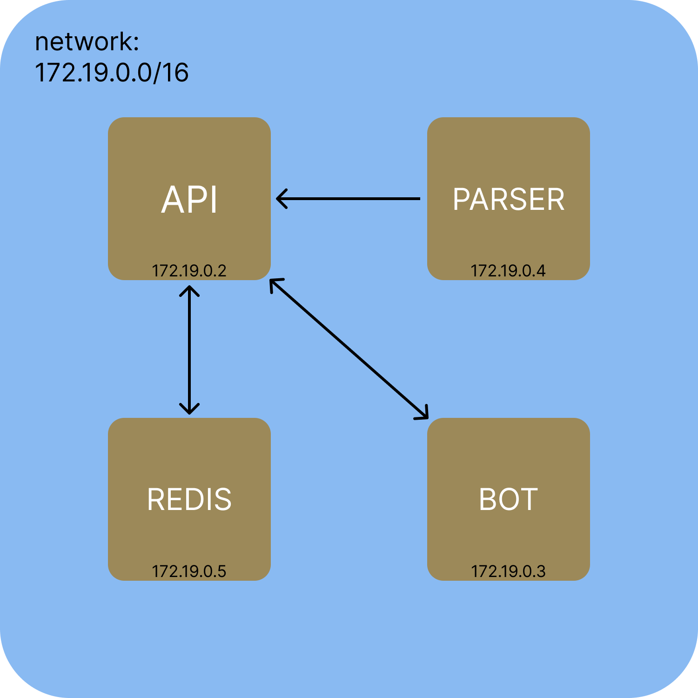

# Campus map bot

**Стек:** `Python`, `Redis`, `Docker`, `CI/CD`, `Linux`  
**Библиотеки:** `FastAPI`, `aiogram`, `asyncio`, `requests`, `logging`, `pydantic`, `re` 

⚡ С помощью этого бота можно узнать в кампусе ли студент и за каким рабочим местом находится.

English readme [here](./readme.md).

## Features

✅ Создание списка друзей, для поиска по всем сразу.  
✅ Быстрый поиск по нику.

## Project structure

Проект состоит из микросервисов. Каждый находится в собственном *docker* контейнере. Все это управляется с помощью *docker-compose*.  
<table>
  <tr>
    <td align="center">
      
    </td>
  </tr>
  <tr>
    <td>
      
схема взаимодействия контейнеров между собой внутри сети

    </td>
  </tr>
</table>

### Frontend 
Сервис отвечает за работу телеграм-бота через REST API который обернуть в библиотеку для python. Отвечает за прием данных от пользователя, отправку этих данных в API, рассылку ответов. 

### Parser
Сервис парсит данные с образовательной платформы.
Авторизуемся на платформе и используя API Школы 21 достаем данные о местоположении студентов и отправляем их в наш API в виде *json*. 
  
### API
Служит связующим звеном между всеми сервисами:
- Принимает запросы с frontend'a, обращается к *Redis* и возвращает данные о запрашиваемых студентах.
- Принимает новые данные о студентах с parser'a и обновляет записи в *Redis*
  
### Redis
Хранит данные о студентах в кампусе и списки друзей в обезличенном виде. Автоматически делает бекап, а при рестарте *docker* контейнера запускается с предыдущего бекапа.
  
## CI/CD
 Мы используем github actions для тестирования кода, автоматической доставки обновлений на сервер.

## Usage example 
<table>
  <tr>
    <td align="center">
      
    </td>
  </tr>
  <tr>
    <td>
      
бот в действии

    </td>
  </tr>
</table>
 
## Other | Links

[Попробовать бота](https://t.me/kzn_campus_map_bot). Пример ника: `jenniffr` или `diamondp`

Присоединяйтесь к [обсуждению](https://github.com/DrVeles/campus_map_bot/discussions).

Сообщайте об ошибках в [issues](https://github.com/DrVeles/campus_map_bot/issues).
